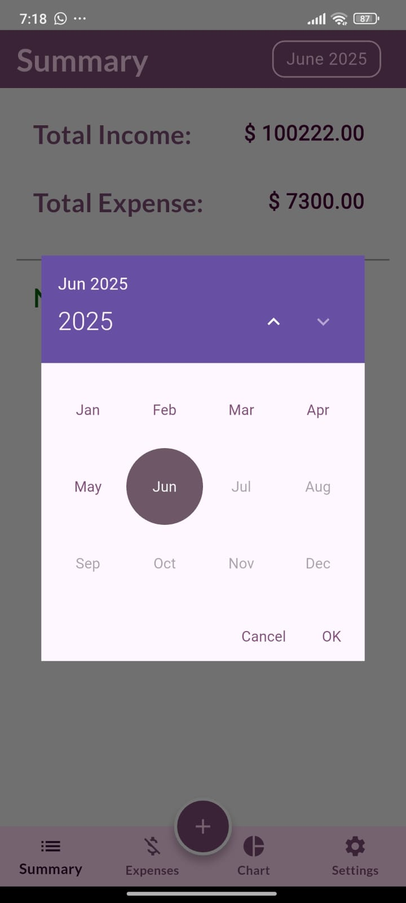

# Flutter Expense Tracker App

A simple and modern Flutter expense tracker app to help you manage your finances.

## Features

- Add, edit, and delete expenses and incomes
- View monthly summaries
- Category selection with icons
- Chart view
- Currency selection
- Privacy policy page
- Responsive design for mobile and tablet


## Screenshots

<!-- Add screenshots here -->
<!--  -->
**Summary Screen**  


**Chart Screen**  


**Expense Screen**  


**Income Screen**  


**Settings Screen**  


**Get Add Buttons**  


**Select Expense Category**  


**Select Income Category**  


**Add Expense Screen**  


**Add Income Screen**  


**Select Currency**  


**Select by Month**  



## Getting Started

### Prerequisites

- [Flutter](https://flutter.dev/docs/get-started/install) (latest stable)
- Android Studio or VS Code

### Installation

1. **Clone the repository:**
    ```sh
    git clone https://github.com/yourusername/flutter_expense_tracker_app.git
    cd flutter_expense_tracker_app
    ```

2. **Install dependencies:**
    ```sh
    flutter pub get
    ```

3. **Run the app:**
    ```sh
    flutter run
    ```

## Building for Release

### Android

```sh
flutter build apk --release

```

## Folder Structure

```
lib/
  ├── main.dart
  ├── screen/
  ├── model/
  └── provider/
```

## Privacy Policy

See the [Privacy Policy](lib/screen/privacy_screen.dart) in the app.


**Made with Flutter ❤️**
